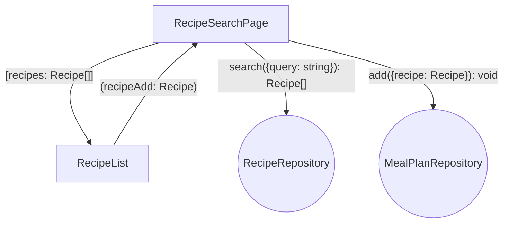
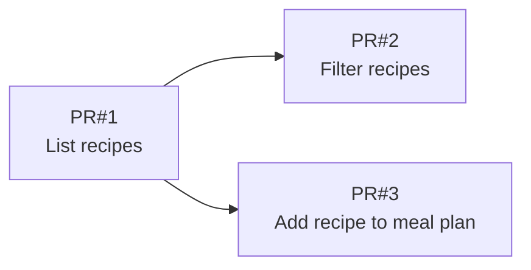

# Goals

- Users building a weekly meal plan struggle to find relevant recipes in a large catalog.
- Picking recipes for the plan takes too many steps and breaks the planning flow.
- Users need confidence they found the right recipe before committing it to the plan.

# Non-Goals

- No server-side search or pagination.
- No recipe editing or creation from this page.
- No meal plan scheduling by day or drag-and-drop ordering.

# Desired Behavior

- [ ] User sees a search input and a list of recipes below it.
- [ ] Typing in the search input filters visible recipes by title.
- [ ] Clearing the search input shows all recipes again.
- [ ] Each recipe row has an "Add to meal plan" button.
- [ ] Clicking "Add to meal plan" adds the recipe and shows a confirmation.
- [ ] Empty search results show a "No recipes found" message.

# Design

- `RecipeSearchPage` owns the search input and filtered recipe list.
- `RecipeRepository` service provides the full recipe catalog.
- `MealPlanRepository` service stores recipes added to the current meal plan.
- Filtering is case-insensitive substring match on recipe title.

## Diagram

## Implementation Details

(Note: this section is removed after the PR Plan is created.)

- [ ] PR#1 — Add `Recipe` interface with `id` and `title` fields.
- [ ] PR#1 — Add `RecipeRepository` with `getRecipes(): Recipe[]`.
- [ ] PR#1 — Scaffold `RecipeSearchPage` with search input and recipe list.
- [ ] PR#1 — Display all recipes from `RecipeRepository`.
- [ ] PR#2 — Filter recipes by case-insensitive substring match on title.
- [ ] PR#2 — Show "No recipes found" when filter matches nothing.
- [ ] PR#3 — Add `MealPlanRepository` with `addRecipe(recipe: Recipe): void`.
- [ ] PR#3 — Add "Add to meal plan" button on each recipe row.
- [ ] PR#3 — Show confirmation toast after a recipe is added.

# Testing Strategy

# PR Plan

🚧 PR#1 — List recipes

## Tasks

- [ ] Add `Recipe` interface with `id` and `title` fields.
- [ ] Add `RecipeRepository` with `getRecipes(): Recipe[]`.
- [ ] Scaffold `RecipeSearchPage` with search input and recipe list.
- [ ] Display all recipes from `RecipeRepository`.

## Testing Strategy

### 🚧 list recipes

- Mount `RecipeSearchPage` with fake repository returning 3 recipes.
- Assert all 3 recipes are displayed with their titles.

🚧 PR#2 — Filter recipes

## Tasks

- [ ] Filter recipes by case-insensitive substring match on title.
- [ ] Show "No recipes found" when filter matches nothing.

## Testing Strategy

### 🚧 filter recipes with matching query

- Mount `RecipeSearchPage` with fake repository returning 3 recipes.
- Type "pasta" in search input.
- Assert only matching recipes are displayed.

### 🚧 filter recipes with no results

- Mount `RecipeSearchPage` with fake repository returning 3 recipes.
- Type "xyz" in search input.
- Assert "No recipes found" message is displayed.

🚧 PR#3 — Add recipe to meal plan

## Tasks

- [ ] Add `MealPlanRepository` with `addRecipe(recipe: Recipe): void`.
- [ ] Add "Add to meal plan" button on each recipe row.
- [ ] Show confirmation toast after a recipe is added.

## Testing Strategy

### 🚧 add recipe to meal plan

- Mount `RecipeSearchPage` with fake repositories.
- Click "Add to meal plan" on the first recipe.
- Assert `MealPlanRepository.addRecipe` was called with the first recipe.
- Assert confirmation toast is displayed.

# Alternatives Considered

- **Client-side regex search** — Rejected; substring match is simpler and sufficient.
- **Inline meal plan sidebar** — Rejected; out of scope; confirmation toast is enough for now.

# Kitchen Sink

## Open Questions

- Should search match recipe tags or ingredients too?
- Should the button be disabled if the recipe is already in the meal plan?

## Future Plans

- Debounce search input for large recipe catalogs.
- Show meal plan preview on the same page.
