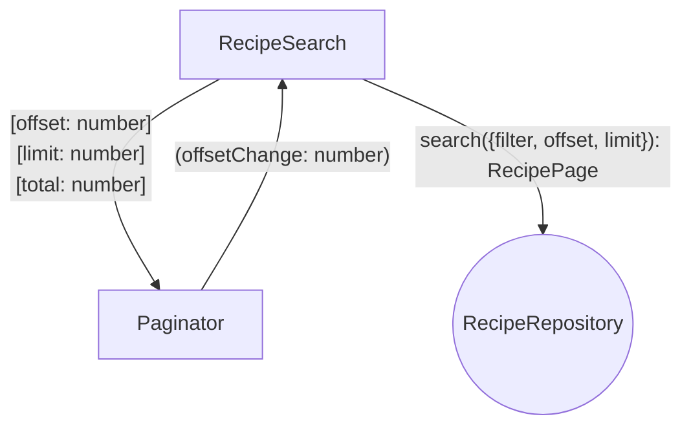
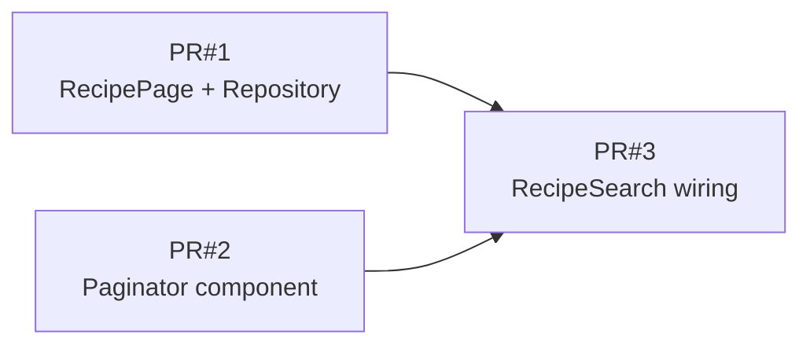

# Goals

- Users should discover more recipes without needing to know exactly what they're looking for.
- Give a simple way to move through the catalog without overwhelming the screen.

# Non-Goals

- No client-side pagination — the API returns one page at a time via `offset` / `limit`.
- No page numbers or jump-to-page controls.
- No "Load more" button or infinite scroll.
- No user-configurable page size — fixed at 5 recipes per page.
- No total count display (e.g. "Page 2 of 10").
- Pagination does not apply to meal planner or other views — only the recipe search page.
- Empty-state behavior when filters return zero recipes is out of scope for this feature.

# Desired Behavior

- [ ] User sees the recipe search page with filter form, a catalog of up to 5 recipes, and Previous / Next buttons below.
- [ ] On initial load, the first page of recipes is fetched from the API and displayed.
- [ ] Previous is disabled on page 1; Next is disabled on the last page (no more recipes available).
- [ ] Clicking Next fetches and displays the next 5 recipes.
- [ ] Clicking Previous fetches and displays the previous 5 recipes.
- [ ] Changing any filter (keywords, max ingredients) resets to page 1 and fetches fresh results.
- [ ] Scroll position is unchanged when navigating between pages.
- [ ] Existing filter and add-to-meal-plan behavior on each recipe card remains unchanged.

# Design

- `RecipeSearch` owns filter state, an `offset` signal, and wires `rxResource` to fetch a page of recipes.
- `Paginator` component renders Previous / Next buttons.
- `Paginator` inputs: `offset`, `limit`, `total`. Output: `offsetChange`.
- `Paginator` derives disabled state internally: Previous when `offset === 0`, Next when `offset + limit >= total`.
- `RecipeRepository.search()` accepts filter + pagination params (`offset`, `limit`) and returns a `RecipePage`.
- `maxIngredientCount` filtering stays client-side after fetch — a page may show fewer than 5 recipes.

## Diagram

# PR Plan

🚧 PR#1 — RecipePage + Repository

## Tasks

- [ ] Add `RecipePage` type with `items: Recipe[]` and `total: number`.
- [ ] Extend `RecipeRepository.search()` to accept `offset` and `limit` params and pass them to the API.
- [ ] Map API response `total` field into `RecipePage`.
- [ ] Keep client-side `maxIngredientCount` filter on fetched items (page may show fewer than 5).
- [ ] Update `RecipeRepositoryFake` to support offset/limit pagination.

🚧 PR#2 — Paginator component

## Tasks

- [ ] Create `Paginator` component with inputs `offset`, `limit`, `total` and output `offsetChange`.
- [ ] `Paginator` disables Previous when `offset === 0`; disables Next when `offset + limit >= total`.

## Testing Strategy

### 🚧 Disables Previous on first page

- Mount `Paginator` with `offset: 0`, `limit: 5`, `total: 10`.
- Assert Previous button is disabled.

### 🚧 Disables Next on last page

- Mount `Paginator` with `offset: 5`, `limit: 5`, `total: 10`.
- Assert Next button is disabled.

### 🚧 Emits offsetChange when Next is clicked

- Mount `Paginator` with `offset: 0`, `limit: 5`, `total: 10` and capture `offsetChange`.
- Click Next.
- Assert `offsetChange` emits `5`.

### 🚧 Emits offsetChange when Previous is clicked

- Mount `Paginator` with `offset: 5`, `limit: 5`, `total: 10` and capture `offsetChange`.
- Click Previous.
- Assert `offsetChange` emits `0`.

🚧 PR#3 — RecipeSearch wiring

## Tasks

- [ ] Add `offset` signal to `RecipeSearch`; combine with filter in `rxResource` params.
- [ ] Reset `offset` to 0 when filter changes.
- [ ] Wire `Paginator` in `RecipeSearch` template, passing `offset`, `limit`, and `total` from `rxResource` result.

## Testing Strategy

### 🚧 Displays first page on load

- Arrange fake repository with 7 recipes.
- Mount `RecipeSearch`.
- Assert 5 recipe headings are visible.
- Assert Previous is disabled and Next is enabled.

### 🚧 Navigates to next page

- Arrange fake repository with 7 recipes.
- Mount `RecipeSearch`.
- Click Next.
- Assert 2 recipe headings are visible.
- Assert Previous is enabled and Next is disabled.

### 🚧 Navigates back to previous page

- Arrange fake repository with 7 recipes.
- Mount `RecipeSearch`; click Next; click Previous.
- Assert 5 recipe headings from the first page are visible again.

### 🚧 Resets to page 1 when filter changes

- Arrange fake repository with 7 recipes including "Burger" and "Salad".
- Mount `RecipeSearch`; click Next to reach page 2.
- Type "Burger" in the keywords field.
- Assert only "Burger" is shown and Previous is disabled.

# Alternatives Considered

- **Client-side pagination** — rejected; server-side keeps payloads small and matches API capabilities (`offset` / `limit`).
- **Load more / infinite scroll** — rejected; prev/next is simpler and fits the discovery use case without growing DOM size.
- **Page numbers** — rejected; out of scope, adds UI complexity without clear benefit at 5 items per page.
- **Fetch-until-full for maxIngredientCount** — rejected; would require multiple API calls per page; acceptable to show fewer than 5 when filtered client-side.

# Kitchen Sink

- `maxIngredientCount` is still filtered client-side — a page may show fewer than 5 recipes even when more exist server-side.
- Server-side `maxIngredientCount` filtering would be a future improvement once the API supports it.
