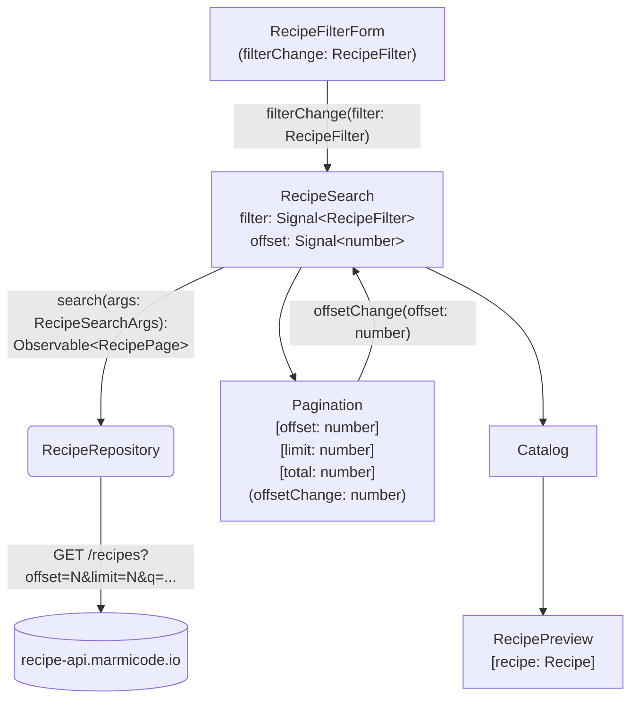
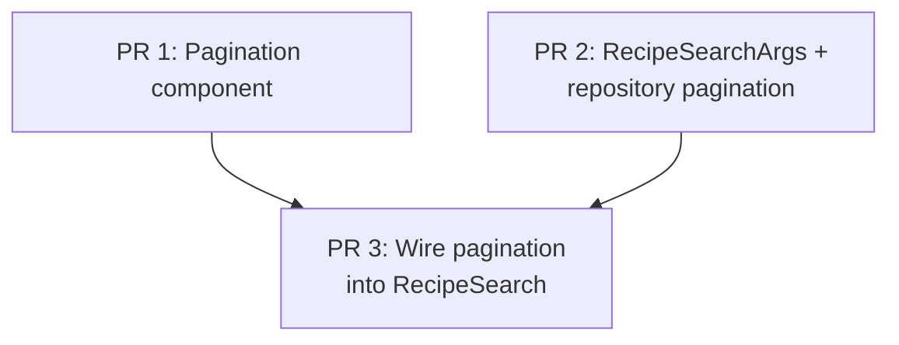

# Goals

- The recipe search API returns a limited number of recipes (currently 5). Users have no way to browse beyond the first page of results.
- Add pagination so users can navigate through all matching recipes page by page.

# Non-Goals

- **Infinite scroll** — against company policy; we use explicit page navigation.
- **Configurable page size** — page size is fixed, not user-adjustable.
- **Caching previous pages** — no pre-fetching or caching of already-visited pages.

# Desired Behavior

- The user opens the recipe search page and sees the first page of recipes (up to 5 results).
- Below the recipe list, "Previous" and "Next" buttons are displayed.
- The user clicks "Next" to load the next page of recipes from the server.
- The user clicks "Previous" to go back to the previous page.
- When on the first page, "Previous" is disabled. When on the last page (no more results), "Next" is disabled.
- A spinner is shown while a page is being fetched.
- When the user changes a filter (keywords, max ingredients, max steps), the results reset to page 1.
- All filtering (including `maxIngredientCount` and `maxStepCount`) happens server-side.

# Design

- **`RecipeSearchArgs`** (new type) — extends `RecipeFilter` with `offset: number` and `limit: number`.
- **`RecipePage`** (new type) — `{ recipes: Recipe[], total: number }`.
- **`RecipeRepositoryDef.search(args: RecipeSearchArgs): Observable<RecipePage>`** — sends `offset`, `limit`, `q`, `maxIngredientCount`, `maxStepCount` as query params to the API. Removes client-side ingredient filtering.
- **`RecipeRepositoryFake`** — updated to implement `search(args: RecipeSearchArgs)` with in-memory filtering, slicing, and total count.
- **`Pagination` component** (in `shared/`) — inputs: `offset`, `limit`, `total`; output: `offsetChange: number`. Computes `hasPrevious = offset > 0` and `hasNext = offset + limit < total` internally. Renders "Previous" and "Next" buttons, disabling each accordingly. Emits new offset on click.
- **`RecipeSearch` component** — adds an `offset` signal (resets to 0 on filter change). Passes `offset`, `PAGE_SIZE` (constant), and `total` from the response to `Pagination`. Shows a spinner while loading.

## Diagram



## Implementation Details

```ts
type RecipeSearchArgs = RecipeFilter & { offset: number; limit: number };
```

# Testing Strategy

## Pagination component

### Disables "Previous" on first page:
- Arrange: offset=0, limit=5, total=20.
- Mount `Pagination` component.
- Assert "Previous" button is disabled.

### Disables "Next" on last page:
- Arrange: offset=15, limit=5, total=20.
- Mount `Pagination` component.
- Assert "Next" button is disabled.

### Enables both buttons on a middle page:
- Arrange: offset=5, limit=5, total=20.
- Mount `Pagination` component.
- Assert both "Previous" and "Next" buttons are enabled.

### Emits new offset on "Next" click:
- Arrange: offset=0, limit=5, total=20.
- Mount `Pagination` component.
- Click "Next".
- Assert `offsetChange` emitted with 5.

### Emits new offset on "Previous" click:
- Arrange: offset=10, limit=5, total=20.
- Mount `Pagination` component.
- Click "Previous".
- Assert `offsetChange` emitted with 5.

### Hides pagination when results fit in one page:
- Arrange: offset=0, limit=5, total=3.
- Mount `Pagination` component.
- Assert pagination is not visible.

## RecipeSearch component

### Displays first page of recipes:
- Arrange: fake repository with 7 recipes (limit=5).
- Mount `RecipeSearch` component.
- Assert 5 recipes displayed.

### Navigates to next page:
- Arrange: fake repository with 7 recipes.
- Mount component, click "Next".
- Assert next 2 recipes displayed.

### Navigates back to previous page:
- Arrange: fake repository with 7 recipes.
- Navigate to page 2, then click "Previous".
- Assert first 5 recipes displayed again.

### Resets to first page on filter change:
- Arrange: fake repository with 7 recipes.
- Navigate to page 2, then change keyword filter.
- Assert offset resets to 0 and first page of filtered results shown.

### Shows spinner while loading:
- Mount `RecipeSearch` component.
- Assert spinner is visible while recipes are loading.

## RecipeRepository (wide test — real HTTP calls)

### Returns paginated results:
- Call `search({ offset: 0, limit: 2 })`.
- Assert response has `recipes` (array of length <= 2) and `total` is a number >= 0.

### Second page returns different recipes:
- Call `search({ offset: 0, limit: 2 })` then `search({ offset: 2, limit: 2 })`.
- Assert the two pages return different recipe IDs.

### Offset beyond total returns empty:
- Call `search({ offset: 0, limit: 1 })` to get `total`.
- Call `search({ offset: total, limit: 1 })`.
- Assert `recipes` is empty.

# PR Plan



- **PR 1 — Scaffold `Pagination` component**: Create the `Pagination` component in `shared/` with inputs (`offset`, `limit`, `total`), output (`offsetChange`), and tests. No integration with `RecipeSearch` yet.
- **PR 2 — Introduce `RecipeSearchArgs`, `RecipePage`, and update repository**: Add the new types. Update `RecipeRepositoryDef`, `RecipeRepository`, and `RecipeRepositoryFake` to use `search(args: RecipeSearchArgs): Observable<RecipePage>`. Update existing callers to pass `{ ...filter, offset: 0, limit: PAGE_SIZE }` so nothing breaks. Includes the wide test against the real API. Remove client-side ingredient filtering.
- **PR 3 — Wire pagination into `RecipeSearch`**: Add `offset` signal, integrate `Pagination` component, reset offset on filter change, add spinner. Update `RecipeSearch` tests.

# Alternatives Considered

- **Infinite scroll** — rejected per company policy.
- **Cursor-based pagination** (using a token instead of offset/limit) — rejected in favor of simpler offset/limit which the API already supports.
- **Client-side pagination** (load all recipes, paginate in memory) — rejected because it defeats the purpose of limiting server response size.

# Kitchen Sink
