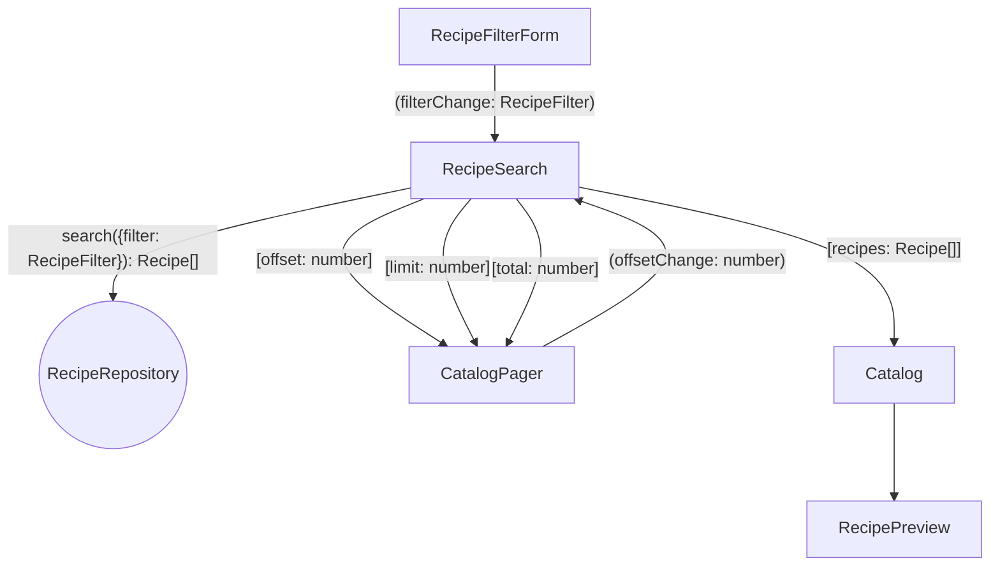

# Goals

- Anyone browsing the recipe catalog from search should be able to see more than a small fixed window of results.
- Today only five recipes are shown (hard-coded cap), so many matching recipes stay hidden and users cannot discover them.
- Pagination should make additional matches reachable without changing how search and filters express intent.

# Non-Goals

- Infinite scroll or a “load more” control instead of discrete pages.
- Configurable page size; page length stays fixed (same as today’s five-recipe window).
- Page index in the URL, deep links, or browser back/forward restoring a page.
- “Page X of Y”, total hit count, or jump-to-page / numbered page links.
- Redesigning the filter form, keywords field, or max-ingredient filter.
- Changes to recipe preview layout or add-to-meal-plan behavior.
- Server-driven pagination API work in this slice (paging is over the current search result set in the client).

# Desired Behavior

- [ ] User sees the recipe catalog with at most five recipe previews visible at a time (same window size as today).
- [ ] User sees previous and next controls when pagination applies; controls are absent or disabled when they do not apply.
- [ ] User clicks next and sees the following five recipes from the current filtered result set; recipe previews update in place.
- [ ] User clicks previous and sees the prior five recipes; previous is disabled on the first page.
- [ ] Next is disabled on the last page (including when the last page has fewer than five recipes).
- [ ] User changes keywords or max-ingredient filter and the view returns to the first page of the new result set.
- [ ] User applies a filter that yields zero recipes and sees the same empty experience as today (no pagination controls needed).
- [ ] User applies a filter with six or fewer matches and only navigates when next would show additional recipes.

# Design

- `RecipeSearch` still loads the full filtered list through `rxResource` and `RecipeRepository.search` (unchanged repository contract).
- `RecipeSearch` owns an `offset` signal (0-based); the filter handler resets `offset` to `0` whenever `RecipeFilter` changes.
- Fixed `limit` of `5` is shared by the slice and the pager (`DEFAULT_PAGE_LIMIT` or similar).
- A `computed` slices `recipes.value()` with `offset()` and `limit` for the catalog `@for`.
- New `CatalogPager` renders Previous / Next with `input()` `offset` and `limit`, and `output()` `offsetChange` (emits the new offset).
- `RecipeSearch` binds `[offset]`, `[limit]`, `[total]`, and `(offsetChange)` → `offset.set($event)`; `total` is the filtered result length (needed to disable Next on the last page).
- `Catalog`, `RecipePreview`, and `RecipeFilterForm` stay as they are; only the data passed into the catalog is paged.
- No new injectable services; paging helpers are pure functions with shared types in `catalog-pagination.ts`.

## Types

`src/app/shared/catalog-pagination.ts` — window + slice helper (no service):

```typescript
export interface CatalogPaginationWindow {
  offset: number;
  limit: number;
}

export interface CatalogPaginationContext extends CatalogPaginationWindow {
  total: number;
}

export function sliceCatalogPage<T>(
  items: readonly T[],
  window: CatalogPaginationWindow,
): T[];
```

`src/app/shared/catalog-pager.ts` — component contract (mirrors `RecipeRepositoryDef` / `RecipeRepository` split):

```typescript
import { CatalogPaginationContext } from './catalog-pagination';

export interface CatalogPagerInputs extends CatalogPaginationContext {}

export type CatalogPagerOffsetChange = number;

export interface CatalogPagerOutputs {
  offsetChange: CatalogPagerOffsetChange;
}

/** Documents the public binding surface of `CatalogPager`. */
export interface CatalogPagerDef extends CatalogPagerInputs, CatalogPagerOutputs {}
```

`CatalogPager` in `catalog-pager.ng.ts` uses `input.required` for each field in `CatalogPagerInputs` and `output<CatalogPagerOffsetChange>()` named `offsetChange`.

`src/app/recipe/recipe-search-pagination.ts` — pagination state owned by `RecipeSearch` (not a separate component):

```typescript
import { CatalogPaginationWindow } from '../shared/catalog-pagination';

export interface RecipeSearchPaginationState extends CatalogPaginationWindow {}

export const DEFAULT_RECIPE_SEARCH_PAGE_LIMIT = 5;

export function createRecipeSearchPaginationState(
  partial?: Partial<RecipeSearchPaginationState>,
): RecipeSearchPaginationState;
```

`createRecipeSearchPaginationState` defaults `{ offset: 0, limit: DEFAULT_RECIPE_SEARCH_PAGE_LIMIT }`.

## Diagram


```mermaid
flowchart TD
  RecipeRepository(("RecipeRepository"))

  RecipeFilterForm -->|"(filterChange: RecipeFilter)"| RecipeSearch
  CatalogPager -->|"(offsetChange: number)"| RecipeSearch
  RecipeSearch -->|"[offset: number]"| CatalogPager
  RecipeSearch -->|"[limit: number]"| CatalogPager
  RecipeSearch -->|"[total: number]"| CatalogPager
  RecipeSearch -->|"search({filter: RecipeFilter}): Recipe[]"| RecipeRepository
  RecipeSearch -->|"[recipes: Recipe[]]"| Catalog
  Catalog --> RecipePreview
```

# PR Plan


```mermaid
flowchart LR
  PR1["PR#1<br>CatalogPager"]
  PR2["PR#2<br>Paged recipe search"]

  PR1 --> PR2
```

<details>
<summary>✅ PR#1 — CatalogPager</summary>

## Tasks

- [x] Add `catalog-pagination.ts` with `CatalogPaginationWindow` and `CatalogPaginationContext`.
- [x] Add `catalog-pager.ts` with `CatalogPagerDef`, `CatalogPagerInputs`, and `CatalogPagerOutputs`.
- [x] Add `catalog-pager.ng.ts` (`wm-catalog-pager`) with required inputs `offset`, `limit`, and `total`; output `offsetChange`.
- [x] Previous emits `offsetChange` with `offset - limit` (clamped at `0`); Next emits `offset + limit` (clamped so the last page is reachable).
- [x] Disable Previous when `offset <= 0`; disable Next when `offset + limit >= total`.

## Testing Strategy

### ✅ Disables Previous at offset zero

- Mount with `offset: 0`, `limit: 5`, `total: 10`.
- Assert Previous is disabled and Next is enabled.

### ✅ Disables Next on the last page

- Mount with `offset: 5`, `limit: 5`, `total: 6`.
- Assert Next is disabled and Previous is enabled.

### ✅ Emits offsetChange when Next is clicked

- Mount with `offset: 0`, `limit: 5`, `total: 10`.
- Click Next.
- Assert `offsetChange` emitted with `5`.

</details>

<details>
<summary>✅ PR#2 — Paged recipe search</summary>

## Tasks

- [x] Add `sliceCatalogPage` to `catalog-pagination.ts`.
- [x] Add `recipe-search-pagination.ts` with `RecipeSearchPaginationState`, `DEFAULT_RECIPE_SEARCH_PAGE_LIMIT`, and `createRecipeSearchPaginationState`.
- [x] Add `offset` signal on `RecipeSearch`; set `offset` to `0` in the `filterChange` handler alongside `filter.set`; bind `limit` from `DEFAULT_RECIPE_SEARCH_PAGE_LIMIT`.
- [x] Add `pagedRecipes` computed via `sliceCatalogPage(recipes.value() ?? [], { offset: offset(), limit })`.
- [x] Render `CatalogPager` only when `total > limit`; omit when `total === 0`.
- [x] Template: `@for (recipe of pagedRecipes(); track recipe.id)` inside `wm-catalog`.
- [x] Wire `(offsetChange)="offset.set($event)"` on `wm-catalog-pager`.

## Testing Strategy

### ✅ Shows only the first five recipes when the result set is larger

- Arrange fake repository with six recipes: Burger, Salad, Pizza, Beer, Tacos, Curry.
- Mount `RecipeSearch`.
- Assert exactly five recipe headings are visible: Burger, Salad, Pizza, Beer, Tacos.

### ✅ Shows next page when user clicks Next

- Same six-recipe arrange.
- Click the Next control.
- Assert one heading visible with text Curry.
- Assert heading Burger is not visible.

### ✅ Disables Previous on the first page

- Arrange Burger, Salad, Pizza, Beer, Tacos, Curry.
- Mount `RecipeSearch`.
- Assert Previous is disabled.

### ✅ Disables Next on the last page

- Arrange Burger, Salad, Pizza, Beer, Tacos, Curry; mount and click Next once.
- Assert Next is disabled.

### ✅ Returns to the first page when the filter changes

- Arrange eleven recipes in order: Burger, Salad, Pizza, Beer, Tacos, Curry, Ramen, Steak, Soup, Pasta, Cake.
- Mount, click Next once (second page shows Curry through Pasta).
- Fill keywords with `Burger` so only one recipe matches.
- Assert the sole visible heading is Burger (offset reset, not still on page two of the full list).

### ✅ Omits pager when results fit in one page

- Arrange four recipes: Burger, Salad, Pizza, Beer.
- Mount `RecipeSearch`.
- Assert Next and Previous are not in the document (or pager host is absent).

</details>

# Alternatives Considered

- **Server-side pagination (`offset` / `limit` on the recipe API)** — Rejected for this slice; non-goal keeps repository contract and avoids API work; client slice matches current fetch-all behavior.
- **Infinite scroll / load more** — Rejected; explicit prev/next matches desired behavior and keeps meal-plan scanning predictable.
- **Paging inside `RecipeRepository.search`** — Rejected; paging is UI state tied to `offset` and filter resets; repository stays a pure “return all matches” API.
- **`canGoPrevious` / `canGoNext` inputs on the pager** — Rejected; boundary logic lives in `CatalogPager` from `offset`, `limit`, and `total`.
- **Single monolithic PR** — Rejected; pager component is testable on its own before wiring search.

# Kitchen Sink

- Confirm where the current five-recipe cap lives in code (not found on main branch at doc time); remove or replace it when wiring `pagedRecipes`.
- Optional follow-up: scroll catalog back to top on page change (out of scope unless users ask).