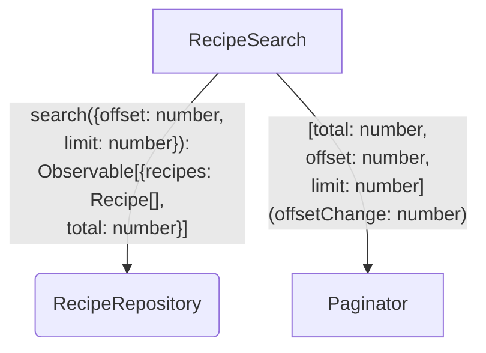
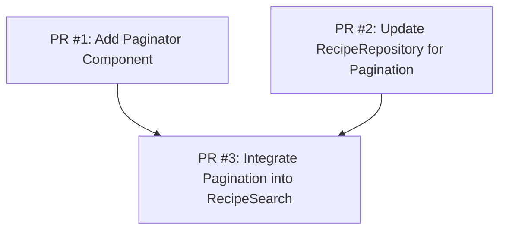

# Goals

We want users to discover more recipes from our catalog.
Filtering criteria are not enough to narrow down the results.
Displaying all results is causing performance issues and bad user experience.

# Non-Goals

No infinite scroll.
No "load more" button..

# Desired Behavior

- Recipe search page now has a next and previous buttons.
- When user clicks next, the next page of recipes is loaded.
- When user clicks previous, the previous page of recipes is loaded.
- When user is on the first page, the previous button is disabled.
- When user is on the last page, the next button is disabled.
- When user is on the first page, the previous button is disabled.
- When user changes the filter, the page is reset to the first page.

# Design

- Use `offset` and `limit` options to paginate the results.
- `limit` is hardcoded to 10 in `RecipeSearch` component.
- Add a `total` field to the response to indicate the total number of recipes.

## Diagram

## Implementation Details

# Testing Strategy

## Paginator

### Disable previous button when on first page

- mount Paginator with offset = 0, limit = 5, and total =
- click previous button
- assert previous button is disabled

### Disable next button when on last page

- mount Paginator with offset = 5, limit = 5, and total = 10
- click next button
- assert next button is disabled

### Emit offsetChange when next button is clicked

- mount Paginator with offset = 0, limit = 5, and total = 10
- click next button
- assert offsetChange is emitted with value 5

### Emit offsetChange when previous button is clicked

- mount Paginator with offset = 10, limit = 5, and total = 15
- click previous button
- assert offsetChange is emitted with value 5

## RecipeSearch

### Show next page when user clicks next button

- set up fake repository with 7 recipes: Burger, Pizza, Salad, Beer, Sushi, Ramen, and Steak.
- mount RecipeSearch
- click next button
- assert Ramen and Steak are the only recipes displayed

### Reset to first page when filters change

- set up fake repository with 7 recipes: Burger, Pizza, Salad, Beer, Sushi, Ramen, and Steak.
- mount RecipeSearch with initial search filters
- click next button
- type Burger
- assert Burger is the only recipe displayed

# PR Plan

## PR #1: Add Paginator Component

- Create `paginator.ng.ts` with inputs for offset, limit, total and output for offsetChange
- Add previous/next buttons with proper disabled states

## PR #2: Update RecipeRepository for Pagination

- Add `offset` and `limit` parameters to `searchRecipes` method
- Update return type to include total count for pagination

## PR #3: Integrate Pagination into RecipeSearch

- Add paginator component to RecipeSearch template
- Wire up offsetChange event to trigger new search
- Reset offset to 0 when search filters change
