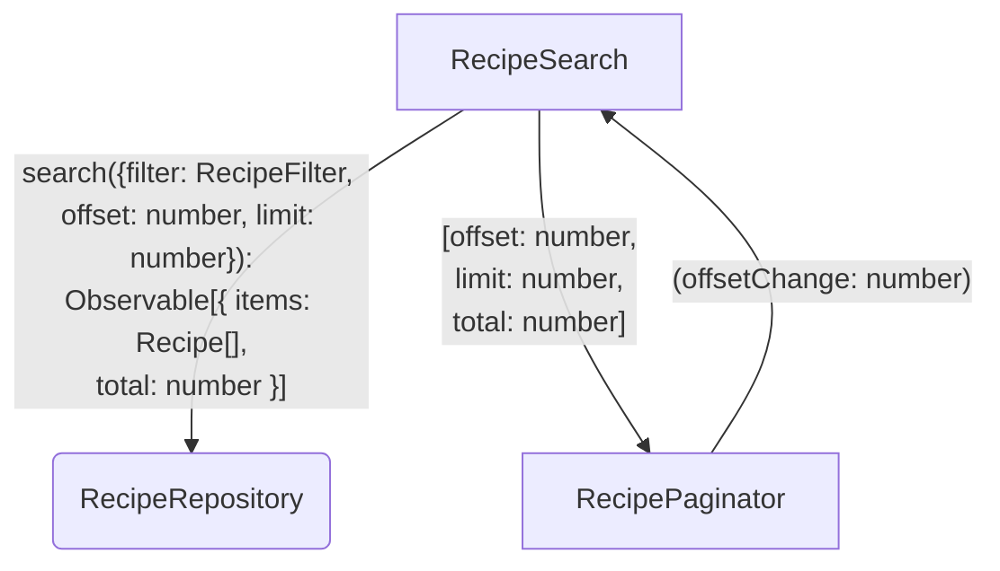

# Goals

We want users to discover the new recipes in our catalogue.
Filtering is not enough to bring the interesting recipes in one page and if we display all of them, it's gonna be performance and UX problems.
That is why we need pagination for recipe search.

# Non-Goals

- No infinite scroll because it's against our organization's ethics
- No dynamic page size because we want to keep things simple

# Desired Behavior

- Pages should have a limit of five recipes
- When the user clicks next, we move to the next page
- When the user clicks previous, we move to the previous page
- When on the first page, the previous button should be disabled
- When on the last page, the next button should be disabled
- When filter criteria changed, we reset to the first page

# Design

## Diagram



## Implementation Details

### RecipeRepository#search

```typescript
class RecipeRepository {
  search(args: {
    filter: RecipeFilter;
    offset: number;
    limit: number;
  }): Observable<{ items: Recipe[]; total: number }>;
}
```

# Testing Strategy

## RecipeSearch

### Go to next page

- Arrange the fake repo with 7 recipes
- Mount the component
- Click next
- Assert the last two recipes are displayed

### When filter changes, reset to the first page

- Arrange the fake repo with 7 recipes including "Burger" and "Another Burger" which are respectively on the first and second page
- Mount the component
- Click next
- Type "Burger" in the search input
- Assert that only "Burger" and "Another Burger" are displayed

## Paginator

### Disables previous button on first page

- Mount the paginator with offset 0 and limit 5, and total 7
- Assert the previous button is disabled

### Disables next button on last page

- Mount the paginator with offset 5, limit 5, and total 7
- Assert the next button is disabled

### Emits offsetChange when next is clicked

- Mount the paginator with offset 0, limit 5, and total 7
- Click the next button
- Assert offsetChange is emitted with value 5

### Emits offsetChange when previous is clicked

- Mount the paginator with offset 5, limit 5, and total 7
- Click the previous button
- Assert offsetChange is emitted with value 0
