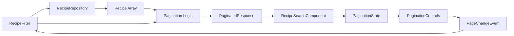

# Data Model: Recipe Search Pagination

**Date**: November 15, 2025
**Purpose**: Define data structures and types for pagination implementation

## Entity Definitions

### 1. PaginationState

Represents the complete pagination state at any given moment.

```typescript
interface PaginationState {
  /**
   * Current page number (1-based indexing for user-facing display)
   * Minimum value: 1
   * Example: 1 (first page), 2 (second page)
   */
  currentPage: number;

  /**
   * Number of items displayed per page
   * Fixed value: 12 (based on spec requirements)
   */
  pageSize: number;

  /**
   * Total number of items across all pages
   * Derived from API response or filtered result count
   */
  totalItems: number;

  /**
   * Total number of pages
   * Calculated: Math.ceil(totalItems / pageSize)
   * Minimum value: 1 (even when totalItems is 0)
   */
  totalPages: number;
}
```

**Validation Rules**:

- `currentPage` must be >= 1 and <= `totalPages`
- `pageSize` must be exactly 12 (not configurable in this version)
- `totalItems` must be >= 0
- `totalPages` must be >= 1

**State Transitions**:

```
Initial State: { currentPage: 1, pageSize: 12, totalItems: 0, totalPages: 1 }

On API Response:
  totalItems = response.items.length (or response.total if provided)
  totalPages = Math.ceil(totalItems / pageSize)
  currentPage = clamp(currentPage, 1, totalPages) // Stay in valid range

On Filter Change:
  currentPage = 1 // Always reset to first page
  (totalItems and totalPages recalculated after new API response)

On Invalid Page in URL:
  currentPage = 1 // Fallback to first page
```

---

### 2. RecipeFilter (Extended)

Existing `RecipeFilter` type extended to include pagination parameters.

**Current Definition** (from `recipe-filter.ts`):

```typescript
interface RecipeFilter {
  keywords?: string;
  maxIngredientCount?: number;
}
```

**Extended Definition**:

```typescript
interface RecipeFilter {
  /**
   * Search keywords for recipe name
   * Optional: undefined means no keyword filter
   */
  keywords?: string;

  /**
   * Maximum number of ingredients in recipe
   * Optional: undefined means no ingredient filter
   */
  maxIngredientCount?: number;

  /**
   * Current page number (1-based)
   * Default: 1
   */
  page?: number;
}
```

**Default Values**:

```typescript
const DEFAULT_FILTER: RecipeFilter = {
  keywords: undefined,
  maxIngredientCount: undefined,
  page: 1,
};
```

**Filter Comparison Logic**:

```typescript
// Two filters are "content-equivalent" if non-page fields match
function areFiltersEquivalent(a: RecipeFilter, b: RecipeFilter): boolean {
  return (
    a.keywords === b.keywords && a.maxIngredientCount === b.maxIngredientCount
  );
}

// Used to determine if page should reset:
// If filters differ (excluding page), reset to page 1
if (!areFiltersEquivalent(oldFilter, newFilter)) {
  newFilter.page = 1;
}
```

---

### 3. PaginatedResponse<T>

Generic type for API responses that include pagination metadata.

```typescript
interface PaginatedResponse<T> {
  /**
   * Array of items for current page
   */
  items: T[];

  /**
   * Total number of items across all pages
   * Used to calculate totalPages
   */
  total: number;

  /**
   * Current page number (1-based)
   */
  page: number;

  /**
   * Items per page
   */
  pageSize: number;
}
```

**Usage Example**:

```typescript
// If API supports pagination:
interface RecipeApiResponse extends PaginatedResponse<Recipe> {}

// If API doesn't support pagination (current scenario):
// Client-side wrapper after fetching all items
function paginateClientSide<T>(
  items: T[],
  page: number,
  pageSize: number
): PaginatedResponse<T> {
  const start = (page - 1) * pageSize;
  const end = start + pageSize;

  return {
    items: items.slice(start, end),
    total: items.length,
    page,
    pageSize,
  };
}
```

---

### 4. PageChangeEvent

Event emitted when user navigates to a different page.

```typescript
interface PageChangeEvent {
  /**
   * Previous page number (1-based)
   */
  previousPage: number;

  /**
   * New page number (1-based)
   */
  newPage: number;

  /**
   * Page size (always 12)
   */
  pageSize: number;

  /**
   * Total number of pages
   */
  totalPages: number;
}
```

**Usage**: Emitted by `wm-pagination-controls` component when user clicks navigation buttons or page numbers.

---

### 5. PaginationConfig

Configuration for pagination behavior (future extensibility).

```typescript
interface PaginationConfig {
  /**
   * Items per page
   * Current version: fixed at 12
   */
  readonly pageSize: 12;

  /**
   * Whether to show first/last page buttons
   * Default: true
   */
  showFirstLastButtons: boolean;

  /**
   * Whether to show page size selector
   * Current version: false (fixed page size)
   */
  showPageSizeSelector: boolean;

  /**
   * Maximum number of page buttons to show
   * Example: With maxPageButtons=5, show: [1][2][3]...[10]
   */
  maxPageButtons: number;
}

const DEFAULT_PAGINATION_CONFIG: PaginationConfig = {
  pageSize: 12,
  showFirstLastButtons: true,
  showPageSizeSelector: false,
  maxPageButtons: 5,
};
```

---

## Relationships

```
RecipeSearchComponent
  ├─ has RecipeFilter (includes page number)
  ├─ has PaginationState (derived from results)
  └─ uses PaginationControlsComponent
      └─ emits PageChangeEvent

RecipeRepository
  ├─ receives RecipeFilter
  └─ returns Recipe[] (all items if client-side)

Client-side pagination logic
  ├─ receives Recipe[] (all results)
  ├─ receives PaginationState (current page)
  └─ returns PaginatedResponse<Recipe> (sliced items)
```



---

## Computed Values & Derivations

### Derive PaginationState from Results and Filter

```typescript
function computePaginationState(
  totalItems: number,
  currentPage: number,
  pageSize: number = 12
): PaginationState {
  const totalPages = Math.max(1, Math.ceil(totalItems / pageSize));
  const clampedPage = Math.max(1, Math.min(currentPage, totalPages));

  return {
    currentPage: clampedPage,
    pageSize,
    totalItems,
    totalPages,
  };
}
```

### Calculate Items for Current Page

```typescript
function getPageItems<T>(
  allItems: T[],
  page: number,
  pageSize: number = 12
): T[] {
  const startIndex = (page - 1) * pageSize;
  const endIndex = startIndex + pageSize;
  return allItems.slice(startIndex, endIndex);
}
```

### Generate Page Numbers for UI

```typescript
function getVisiblePageNumbers(
  currentPage: number,
  totalPages: number,
  maxVisible: number = 5
): (number | 'ellipsis')[] {
  if (totalPages <= maxVisible) {
    return Array.from({ length: totalPages }, (_, i) => i + 1);
  }

  const pages: (number | 'ellipsis')[] = [1];

  if (currentPage > 3) {
    pages.push('ellipsis');
  }

  const start = Math.max(2, currentPage - 1);
  const end = Math.min(totalPages - 1, currentPage + 1);

  for (let i = start; i <= end; i++) {
    pages.push(i);
  }

  if (currentPage < totalPages - 2) {
    pages.push('ellipsis');
  }

  if (totalPages > 1) {
    pages.push(totalPages);
  }

  return pages;
}

// Example outputs:
// getVisiblePageNumbers(1, 10, 5) → [1, 2, 3, 'ellipsis', 10]
// getVisiblePageNumbers(5, 10, 5) → [1, 'ellipsis', 4, 5, 6, 'ellipsis', 10]
// getVisiblePageNumbers(10, 10, 5) → [1, 'ellipsis', 8, 9, 10]
```

---

## Validation & Error Handling

### Invalid Page Numbers

```typescript
function normalizePageNumber(page: unknown, totalPages: number): number {
  // Convert to number
  const pageNum = Number(page);

  // Handle invalid inputs
  if (!Number.isFinite(pageNum) || pageNum < 1) {
    return 1; // Default to first page
  }

  // Clamp to valid range
  return Math.min(pageNum, totalPages);
}
```

### Empty Results

```typescript
function shouldShowPagination(totalItems: number, pageSize: number): boolean {
  return totalItems > pageSize;
}

// Usage in template:
// @if (shouldShowPagination(totalItems(), pageSize())) {
//   <wm-pagination-controls />
// }
```

---

## Migration Impact

### Existing Code Changes

**recipe-filter.ts**:

- Add `page?: number` to `RecipeFilter` interface
- Update `createRecipeFilter()` factory to handle page parameter

**recipe-repository.ts**:

- No changes needed initially (client-side pagination)
- Future: Add pagination params to API query if server-side pagination added

**recipe-search.ng.ts**:

- Add pagination state signals
- Add client-side slicing logic
- Update template to include pagination controls

**recipe-repository.fake.ts**:

- Update fake to support page parameter in filter
- Return appropriate subset of test data

---

## Testing Considerations

### Test Data Builders

```typescript
// In recipe.mother.ts or new pagination.mother.ts
export const paginationStateMother = {
  withDefaults: () => ({
    currentPage: 1,
    pageSize: 12,
    totalItems: 50,
    totalPages: 5,
  }),

  withPage: (page: number) => ({
    ...paginationStateMother.withDefaults(),
    currentPage: page,
  }),

  withSinglePage: () => ({
    currentPage: 1,
    pageSize: 12,
    totalItems: 10,
    totalPages: 1,
  }),

  withEmptyResults: () => ({
    currentPage: 1,
    pageSize: 12,
    totalItems: 0,
    totalPages: 1,
  }),
};
```

### Key Test Scenarios

1. **Pagination state calculation**: Verify `computePaginationState()` with various inputs
2. **Page slicing**: Verify `getPageItems()` returns correct subset
3. **Page number normalization**: Test invalid inputs (negative, zero, too high, non-numeric)
4. **Filter equivalence**: Test `areFiltersEquivalent()` logic
5. **Page number visibility**: Test `getVisiblePageNumbers()` edge cases

---

## Performance Considerations

### Memory Usage

- **Client-side pagination**: All recipes held in memory
- Typical search: 50-200 recipes × ~1KB each = 50-200KB
- Acceptable for web application memory constraints

### Computation Cost

- Page slicing: O(1) operation (array.slice() is efficient)
- State calculations: All O(1) operations
- No performance concerns for typical result sets (<1000 items)

### Future Optimization Opportunities

- Virtual scrolling for very large result sets
- Server-side pagination to reduce initial load
- Result caching to avoid re-fetching on filter changes
- Prefetching adjacent pages for instant navigation
